# 📽️프로젝트 명세서

***

### Background

우리는 작은 로컬 카페 **Grids & Circles** 입니다. 고객들이 Coffe Bean package를 온라인 웹 사이트로 주문합니다. 매일 전날 오후 2시부터 오늘 오후 2시까지의 주문을 모아서
처리합니다.

현재는 총 4개의 상품이 존재합니다.

우리는 별도의 회원을 관리하지 않습니다. email로 고객을 구분해요. 주문을 받을 때 email을 같이 받아서 주문을 받습니다. 하나의 email로 하루에 여러 번 주문을 받더라도 하나로 합쳐서 다음날 배송을
보내면 됩니다.

<aside>
💡

고객에게 **“당일 오후 2시 이후의 주문은 다음날 배송을 시작합니다.”** 라고 알려 줍니다.

</aside>

### **결과물 예시**

<center>
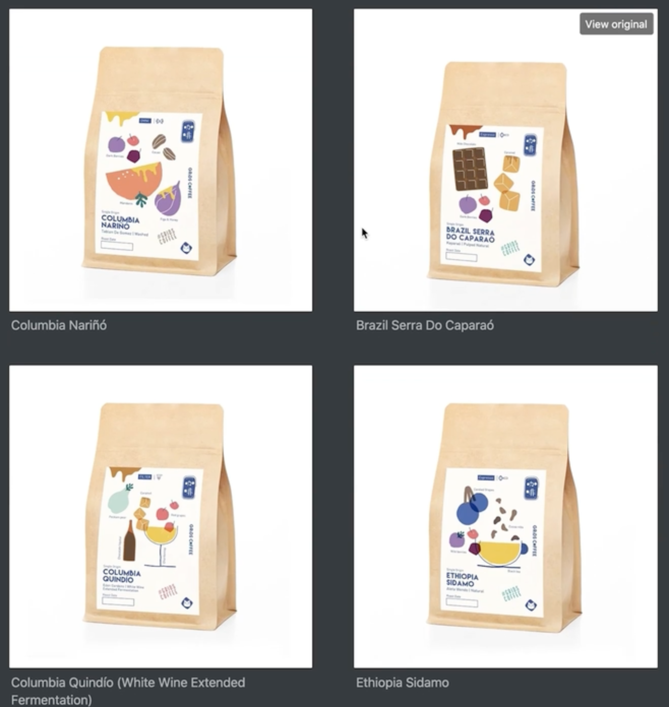
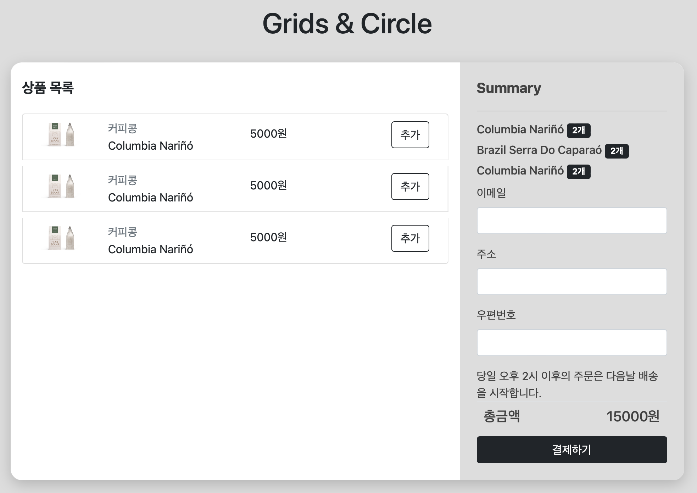
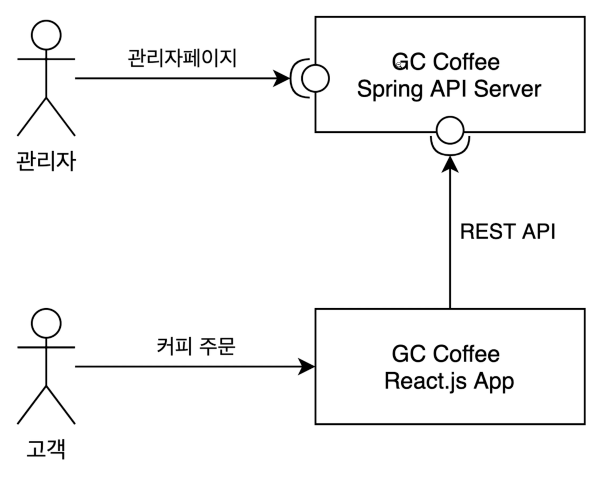
</center>

***

# 👥팀원

- 윤이건 - 팀장, 전체 예외 처리, 로그 처리 개발
- 윤수빈 - 프론트 개발
- 박상혁 - 문서화 작업
- 박윤영 - 배송상태, 수량 관리 기능 개발
- 이민정 - 인기 상품 조회 API 및 서비스 개발
- 이현섭 - 페이징 기능 개발, 테스트 데이터 작업

***

## 👤 사용자

### 📑 주문

1. 사용자는 커피를 주문할 수 있다.
    1. 주문할 상품, 주소, 우편번호를 받아서 주문 데이터 저장
    2. 주문할 때 수량이 0 이하로 떨어지면 오류 발생 (예외 처리)
2. 사용자는 자신의 주문 내역을 조회할 수 있다.
    1. 주문 내역에는 총 금액(totalprice)을 반환한다
    2. 페이징 기능
3. 사용자는 자신의 주문 내역 중 배송지 정보를 수정할 수 있다.
    1. 배송하기 전이라면 수정할 수 있음 → 기존 코드에서 약간의 수정만
       (배송 상태가 ACCEPTED, PAYMENT_CONFIRMED라면 수정 가능)
4. 사용자는 자신의 주문을 취소할 수 있다.
    1. 배송하기 전이라면 취소할 수 있음 → 기존 코드에서 약간의 수정만
       (배송 상태가 ACCEPTED, PAYMENT_CONFIRMED라면 취소 가능)

### ☕ 커피

1. 등록한 커피 목록을 조회할 수 있다.
    1. 상품 타입, 원두 이름, 가격, (stock, 맛 추가설명)
    2. 페이징 기능
    3. 인기 상품 3개 조회 (판매량 기준)

## 👨🏽‍💼 관리자

### 📑 주문

1. 모든 사용자의 주문 내역을 조회할 수 있다.
    1. 주문 상태에 따라 검색
       (ACCEPTED, PAYMENT_CONFIRMED, READY_FOR_DELIVERY, SHIPPED,SETTLED, CANCELLED)

### ☕ 커피

1. 커피를 추가할 수 있다.
2. 커피 정보를 수정할 수 있다.
3. 커피 정보를 삭제할 수 있다.

***

## 💽스키마

<center>
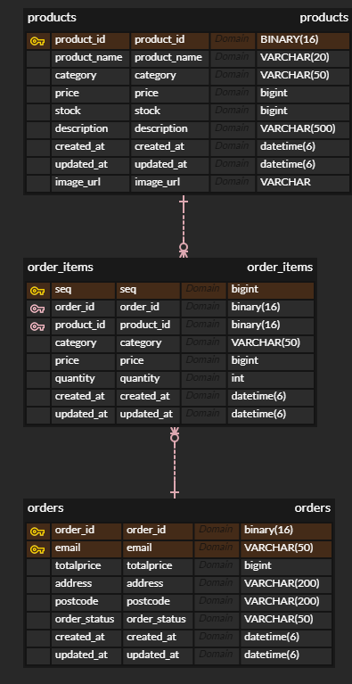
</center>

```sql
CREATE TABLE products
(
    product_id   BINARY(36) PRIMARY KEY,
    product_name VARCHAR(20)  NOT NULL,
    category     VARCHAR(50)  NOT NULL,
    price        bigint       NOT NULL,
    stock        bigint       NOT NULL,
    description  VARCHAR(500) DEFAULT NULL,
    image_url    VARCHAR(500) NOT NULL,
    created_at   datetime(6)  NOT NULL,
    updated_at   datetime (6) DEFAULT NULL
);

CREATE TABLE orders
(
    order_id     binary(36) PRIMARY KEY,
    email        VARCHAR(50)  NOT NULL,
    address      VARCHAR(200) NOT NULL,
    postcode     VARCHAR(200) NOT NULL,
    order_status VARCHAR(50)  NOT NULL,
    created_at   datetime(6)  NOT NULL,
    updated_at   datetime(6) DEFAULT NULL,
    INDEX idx_email (email) -- email 컬럼에 인덱스 추가
);

CREATE TABLE order_items
(
    seq        bigint      NOT NULL PRIMARY KEY AUTO_INCREMENT,
    order_id   binary(36)  NOT NULL,
    product_id binary(36)  NOT NULL,
    category   VARCHAR(50) NOT NULL,
    price      bigint      NOT NULL,
    quantity   int         NOT NULL,
    created_at datetime(6) NOT NULL,
    updated_at datetime(6) DEFAULT NULL,
    INDEX (order_id),
    CONSTRAINT fk_order_items_to_order FOREIGN KEY (order_id) REFERENCES orders (order_id) ON DELETE CASCADE,
    CONSTRAINT fk_order_items_to_product FOREIGN KEY (product_id) REFERENCES products (product_id)
);
```

# 📄API 문서

[API 명세서](api_docs.md)

# 💼Usecase diagram

<center>
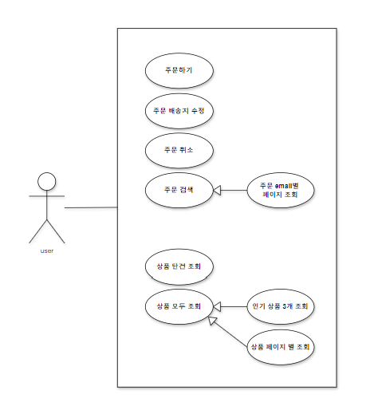
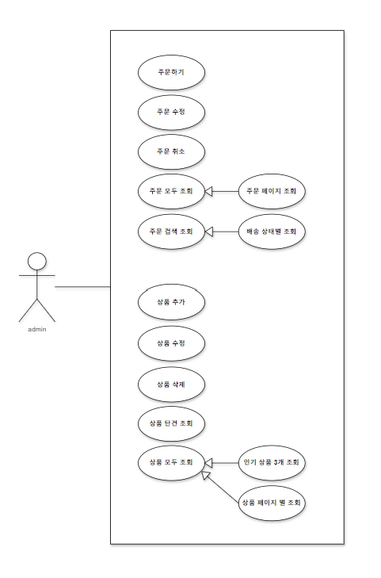
</center>

# ⏩Flow chart

<center>
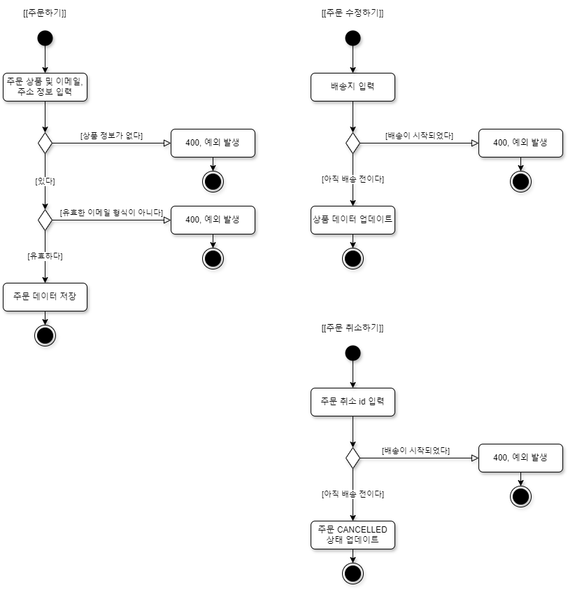
</center>

# 📟화면

- **메인 페이지**:
    - 현재 판매량 기준 인기 상품 조회
    <div>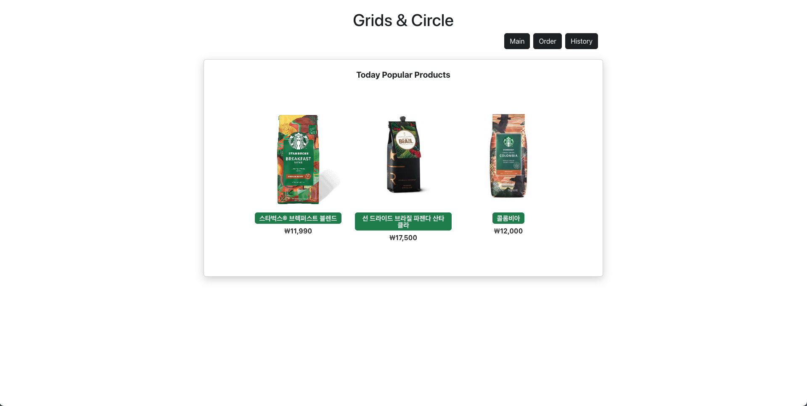</div>
- **주문 페이지**:
  <div> </div>
  
    - 사용자가 상품을 주문하는 페이지
    - 상품 목록을 페이징해서 보여줍니다.
    - 장바구니(Summary)에 상품을 추가하고 제거할 수 있습니다.
- **주문 내역 페이지**:
    <div>
        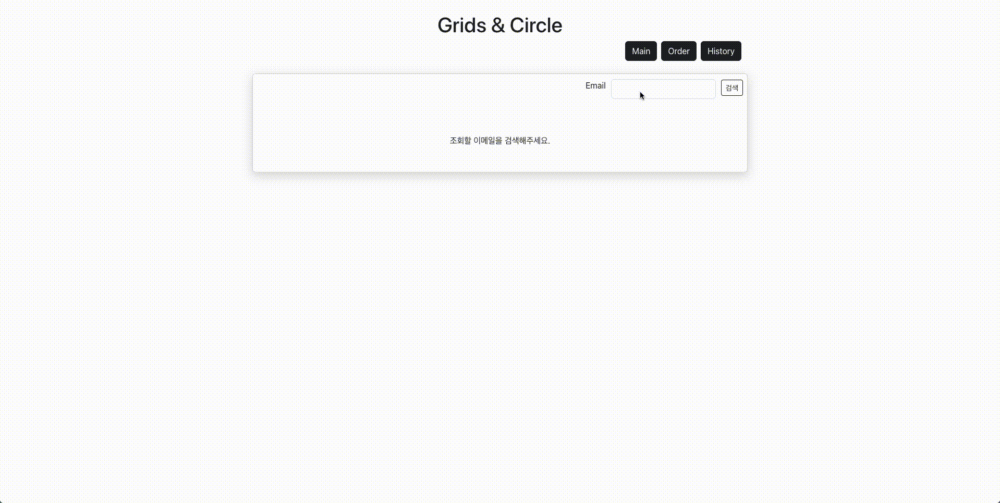
        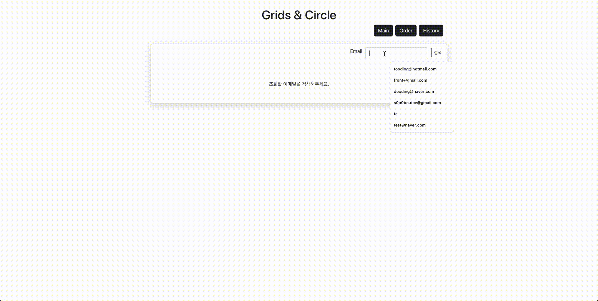 
    </div>
    
    - 이메일로 사용자의 주문 내역을 페이징해서 보여줍니다.
    - 주문 정보(주소, 우편번호)를 수정할 수 있습니다.
    - 주문이 아직 처리되지 않았으면 주문을 취소할 수 있습니다.

# 컨벤션

프로젝트 명: `NBE1_1_Team08`

패키지: `nbe1.team08`

# 💬Git-flow 전략

- **master** : 배포가 가능한 가장 메인이 되는 브랜치
- **hotpix** : 빠르게 버그를 수정해야 할 때 사용하는 브랜치
- **release** : 프로젝트 배포를 준비하기 위해 사용하는 브랜치
- **develop** : 개발 과정에서 사용하는 중심 브랜치
    - **feat** : 각 기능을 구현할 때 사용하는 브랜치
    <div>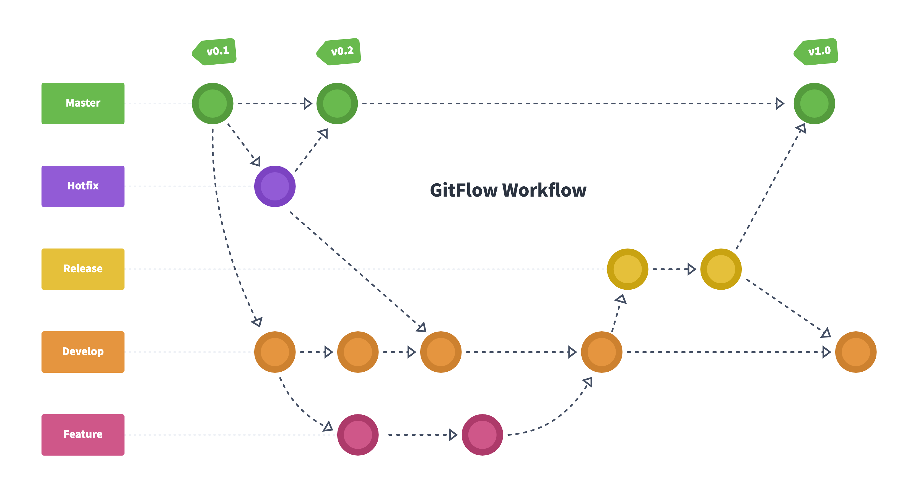</div> 